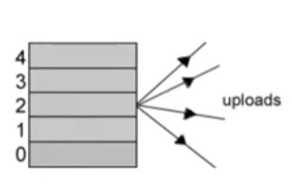
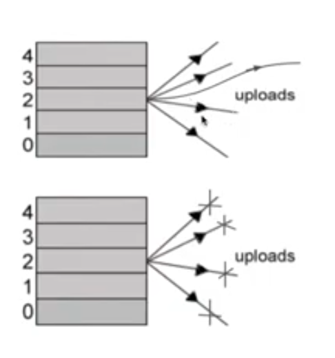

## Peer to Peer Networks

_P2P networks can be broadly divided into two categories:_

1. Pure P2P - all peers are equal, any arbitrary peer can be removed without any loss
2. Hybrid P2P - A central entity is necessary to provide parts of the service

The **_BitTorrent_** Architecutre follows the hybrid P2P model, which consists of the following:

1.  A tracker - a server that keeps track of all the peers.
2.  static meta into file - information of the server, IP, and details/name of the original file - which contains hashes of the pieces.
3.  original downloader - any peer who has the full file, also called oeer
4.  end user/downloader - peers without a complete copy of the file

- BitTorrent simultaneously downloads the file from multiple peers by breaking the file into pieces of 512 or 256kb
- Choosing piece to download is dont through the Piece Selection Algorithm, consistent download called _choking_.

### Piece Selection Algorithm

- The Goal is to quickly replicate all pieces.

1. Random first piece - the first piece is randomly selected to quickly create a piece replica and participate in uploading. Basically this just picks a random piece and downloads as quickly as possible.
2. Rarest first - after the first peice, the rarest piece in the swarm is selected. In short, we want the piece that hasn't been downloaded by other peers, so that we can, in turn, serve that piece to other members of the swarm.
3. Strict Policy - Each piece is then further divided into sub-pieces. When a sub-piece is requested, all sub-pieces are requested before others. You can't request a sub-piece of a different piece, before downloading all of the sub-pieces of current piece.
4. End game mode - during the end of the download, the download typically slows down. To combat this, a request is sent to all the peers and a cancel is sent after receiving the piece. There is no rarest piece calculation. The first peer to respond to this is called the _fastest peer_. Once we recieve, we immediatly sent a cancel request to all the other peers.

### Choking

Choking is denying an update to a peer, allowing for a consistent download rate.

##### Policies

- By default, 4 peers are unchoked
- Decided by the download rate being received
  
- The problem is that we don't know which 4 peers are the best peers, so we need additional policies

  1. Download phase
     - Otimistic unchoke - apart from the default 4, an additional random unchoke to look for better connections
     - Anti snubbing - If a peer doesn't get any message in 60s, it chokes all connected peers and increases optimistic un-chokes, inturn increasing its chances of getting an optimistic unchoke.
  2. Upload phase
     - Once a peer has all pieces it switches to unchoking peers based on upload rates. In other words, the peer finds the peers with the best upload rate, so that the pieces it currently has can be replicated and distributed as fast as possible.

  

  # UDP Tracker Protocol for BitTorrent

- In order to discover other peers in a swarm, a client first announces its existance to a tracker through the HTTP protocol
- A typical request contains
  1. info_hash
  2. key
  3. peer_id
  4. port
  5. downloaded
  6. left
  7. uploaded
  8. compact
- A typical response contains
  1. A list of peers (host and port)
  2. Other information
- Using UDP significantly reduces overhead, but is unreliable. It doesn't retransmit lost packets itself. Rather, the application is responsible for this. If a response is not received after 15 \* 2 ^ n seconds, the client should retransmit the request, where n starts at 0 and is increased up to 8 (3840 seconds) after every retransmission.

  - Examples:

    ````Normal announce:

    t = 0: connect request
    t = 1: connect response
    t = 2: announce request
    t = 3: announce response

    Connect times out:

    t = 0: connect request
    t = 15: connect request
    t = 45: connect request
    t = 105: connect request
    etc

    Announce times out:

    t = 0:
    t = 0: connect request
    t = 1: connect response
    t = 2: announce request
    t = 17: announce request
    t = 47: announce request
    t = 107: connect request (because connection ID expired)
    t = 227: connect request
    etc

    Multiple requests:

    t = 0: connect request
    t = 1: connect response
    t = 2: announce request
    t = 3: announce response
    t = 4: announce request
    t = 5: announce response
    t = 60: announce request
    t = 61: announce response
    t = 62: connect request
    t = 63: connect response
    t = 64: announce request
    t = 64: scrape request
    t = 64: scrape request
    t = 64: announce request
    t = 65: announce response
    t = 66: announce response
    t = 67: scrape response
    t = 68: scrape response ```
    ````

### UDP Tracker

- All values sent in network byte order and packets are not in exact sizes.
- Before announcing / scraping, you have to obtain a connection ID
  1. Choose a random transaction ID
  2. Fill the connect request structure
  3. Send the packet
